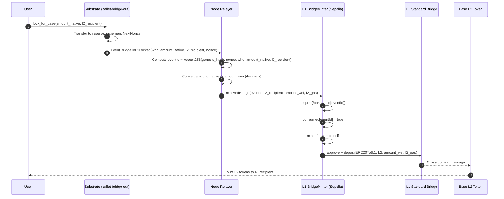

# Mod-Net Bridge: Architecture and Security Report

Generated on 2025-09-11

Sources reviewed:
- Library root: `~/repos/comai/mod-net/bridge/`
- Key docs: `docs/project_spec.md`, `docs/substrate-to-base-bridge-starter.md`, `README.md`
- Ops config: `ops/addresses.json`
- Scripts: `scripts/` and `packages/` scaffolding

## Overview

The Mod-Net bridge moves value from a Substrate solo chain ("subspace") to Base (OP Stack L2) via Ethereum L1 using audited components. It intentionally avoids bespoke bridging mechanics:

- Substrate → Ethereum L1: off-chain relayer consumes a replay-safe on-chain event from the Substrate pallet and calls an L1 contract (`BridgeMinter`).
- Ethereum L1 → Base: `BridgeMinter` mints L1 ERC-20 and deposits to Base using the OP Standard Bridge.

This separates concerns between on-chain event production (Substrate), L1 custody/mint/bridge (BridgeMinter), and networking (OP Standard Bridge).

## Components

- Substrate runtime pallet: `pallet-bridge-out` in your node repo
  - Emits `BridgeToL1Locked(who, amount_native, l2_recipient, nonce)` when a user locks native tokens.
  - Maintains `NextNonce` and a deterministic reserve account (`PalletId.into_account_truncating()`).
  - See: `docs/project_spec.md` section 1.1.

- Node-integrated relayer task
  - Subscribes to Substrate events, derives `eventId`, performs unit conversion, and calls the L1 `BridgeMinter.mintAndBridge(...)`.
  - Leader selection among nodes avoids duplicate gas spend.
  - See: `docs/project_spec.md` section 1.2 and `docs/substrate-to-base-bridge-starter.md` (Relayer section).

- L1 contracts/tools (bridge library)
  - `BridgeMinter` (Sepolia/Ethereum): holds `MINTER_ROLE` on the L1 token, enforces single consumption per `eventId`, and deposits to Base via the OP Standard Bridge.
  - L1 ERC‑20 (`MyL1Token`): OpenZeppelin ERC20 + AccessControl + Permit; `MINTER_ROLE` is assigned to `BridgeMinter`.
  - L2 token (Base): `OptimismMintableERC20` deployed via the official factory, paired via `remoteToken()`.
  - See: `docs/project_spec.md` section 2.x and `docs/substrate-to-base-bridge-starter.md`.

- Address/config management
  - `ops/addresses.json` is the single source of truth for per-network addresses (L1StandardBridge, CrossDomainMessenger, factories, tokens, BridgeMinter, Snowbridge endpoints).
  - `.env(.sample)` carries RPCs, keys, and operational params.

- Tooling and scripts
  - Foundry and Hardhat scripts to deploy L2 token and perform L1→L2 deposits.
  - Operational scripts in `scripts/` including relayer runner (`run_relayer.sh`) and verification helpers (e.g., `check_balance.sh`).

## End-to-end Flow

1) User on Substrate calls `lock_for_base(amount, l2_recipient)` in `pallet-bridge-out`.
2) Pallet transfers native tokens into a deterministic reserve account and emits `BridgeToL1Locked(..., nonce)`; `NextNonce` increments.
3) Node relayer watches the chain, derives:
   - `eventId = keccak256(abi.encode("SUBSPACE", genesis_hash, nonce, who, amount_native, l2_recipient))`.
   - Converts `amount_native` to ERC‑20 wei using configured decimals.
4) Relayer checks `BridgeMinter.consumed(eventId) == false` and, if leader, calls `mintAndBridge(eventId, l2_recipient, amount_wei, l2_gas)` on Sepolia.
5) `BridgeMinter` marks `eventId` consumed, mints L1 ERC‑20 to itself, approves the L1 Standard Bridge, and calls `depositERC20To` to Base.
6) On Base, the paired `OptimismMintableERC20` mints to `l2_recipient`. Supply invariant is checked off-chain.

References: `docs/project_spec.md` sections 1.1, 1.2, 2.3, and 4; `docs/substrate-to-base-bridge-starter.md` (EventId derivation, relay steps).

### Sequence diagram

## Security Model and Features

- Replay protection on L1
  - `BridgeMinter` records `consumed[eventId]` so each Substrate event is processed exactly once.
  - Reattempts revert with `AlreadyConsumed` and are quarantined by the relayer logic.

- Relayer authorization
  - Only whitelisted EOAs can call `mintAndBridge` (`onlyRelayer`).
  - Node private keys are not granted mint capabilities; only `BridgeMinter` holds `MINTER_ROLE` on the token.

- Separation of duties (least privilege)
  - `MINTER_ROLE` is restricted to the `BridgeMinter` contract.
  - Admin operations are separated (AccessControl `DEFAULT_ADMIN_ROLE`), recommended to be held by a Safe.

- Leader election among nodes
  - Deterministic leader selection per nonce avoids duplicate gas spend: `idx = keccak256(nonce || best_block_hash) % N`.
  - Optional fallback transfers leadership if no success within T blocks.

- Supply conservation invariant
  - Off-chain script checks `l1_escrow_equals_l2_supply` and computes `delta_wei` to ensure no drift between locked Substrate funds, L1 escrow, and L2 total supply.
  - See `README.md` (check:supply) and `docs/substrate-to-base-bridge-starter.md` (checkSupply scripts).

- Unit conversion correctness
  - Explicit `SUB_DEC` vs `ERC_DEC` conversion rules to prevent rounding errors or over/under-minting.

- Audited base layers
  - Leverages OP Standard Bridge and Optimism mintable tokens on Base, as well as OpenZeppelin ERC‑20/AccessControl.

- Configuration integrity
  - Canonical addresses are declared in `ops/addresses.json`. Scripts and operational tooling read from this file to avoid mismatches.

- Observability and resilience
  - Relayer logs include nonce and tx hash; optional metrics for seen/relayed/failed/retried.
  - Exponential backoff on RPC errors; liveness probes; quarantining of bad events.

## Threat Model and Mitigations

- Duplicate relay attempts
  - Mitigated by eventId replay guard and leader election.

- Malicious or misconfigured relayer EOA
  - Requires whitelisting in `BridgeMinter`. Can be revoked by admin.
  - EOAs do not hold mint permissions; only BridgeMinter can mint and bridge.

- Compromise of admin keys
  - Minimize risk by moving `DEFAULT_ADMIN_ROLE` to a multi-sig Safe.
  - Consider timelocks or 2-step admin changes for production.

- Address spoofing/mismatch
  - Single source of truth in `ops/addresses.json`; scripts verify `remoteToken()` pairing on L2.

- L1/L2 RPC instability
  - Backoff/retry and leader fallback reduce failed relays and stuck states.

- Supply drift or accounting errors
  - Off-chain invariant check (`check:supply`) compares L1 escrow vs L2 total supply; CI or ops can gate on zero delta.

- Event forgery or chain reorganizations
  - EventId commits to chain genesis hash, nonce, and SCALE-encoded fields. For deeper economic security, future upgrade proposes M-of-N validator attestations.

## Operational Guidance

- Keys and env
  - `.env.sample` documents required RPCs and keys; keep production secrets out of the repo and use a secrets manager.
  - Prefer a Safe for admin roles.

- Address management
  - Set/verify contract addresses in `ops/addresses.json`; verify OP Stack addresses against Base docs.

- Relayer configuration
  - Run node with `--bridge.*` flags or corresponding env vars (see `docs/substrate-to-base-bridge-starter.md`).

- Testing
  - Unit tests for pallet behavior, BridgeMinter guards, and happy-path deposits.
  - Integration on Sepolia/Base Sepolia; verify `remoteToken()` and supply invariants.

## Production Hardening Checklist

- Governance and keys
  - Move `DEFAULT_ADMIN_ROLE` to a multi-sig Safe; restrict `setRelayer`/admin actions.
  - Use distinct EOAs for relaying; rotate keys; store secrets in a manager (no plaintext envs in prod).

- Contract configuration and verification
  - Verify addresses in `ops/addresses.json` against official Base/Sepolia docs before deploys.
  - Assert `OptimismMintableERC20.remoteToken() == L1 token` as part of CI.
  - Enable contract verification on explorers where applicable.

- Relayer operations
  - Run multiple nodes; enable deterministic leader selection and fallback. To be run on existing nodes to distribute consensus.
  - Configure exponential backoff, RPC redundancy, and health checks.
  - Emit structured logs; expose Prometheus metrics for seen/relayed/failed/retried.

- Invariants and monitoring
  - Automate `check:supply` in CI/cron; alert on non-zero deltas.
  - Track per-nonce lifecycle and alert on stuck/unconsumed events.

- Change management
  - Protect release branches; require reviews and passing checks.
  - For upgrades, use timelocks or staged rollouts where possible.

## Future Enhancements

- M-of-N attestations (upgrade path)
  - Replace relayer whitelist with validator-set signatures over `eventId` (EIP-712) and on-chain threshold verification.
  - Maintains the same external interface for `BridgeMinter` to minimize relayer changes.

- Monitoring/metrics
  - Add Prometheus metrics for relay outcomes and RPC health; alert on invariant failures or lagging nonces.

## Appendix: Network Addresses (current)

Derived from `mod-net/bridge/ops/addresses.json` at the time of writing; verify before use.

- Ethereum mainnet (`ethereum`)
  - L1StandardBridge: `0x3154Cf16ccdb4C6d922629664174b904d80F2C35`
  - L1CrossDomainMessenger: `0x866E82a600A1414e583f7F13623F1aC5d58b0Afa`
  - OptimismMintableERC20Factory: `0x05cc379EBD9B30BbA19C6fA282AB29218EC61D84`
  - L1Token: [set in ops/addresses.json]
  - BridgeMinter: [set after deploy]

- Ethereum Sepolia (`sepolia`)
  - L1StandardBridge: `0xfd0Bf71F60660E2f608ed56e1659C450eB113120`
  - L1CrossDomainMessenger: `0xC34855F4De64F1840e5686e64278da901e261f20`
  - OptimismMintableERC20Factory: `0xb1efB9650aD6d0CC1ed3Ac4a0B7f1D5732696D37`
  - L1Token: `0xd035e701BEFaE437d9eC5237646Ff7AD8E9174c4`
  - BridgeMinter: `0xbF6197e94C011a3Af999e0c881794749fc52A908`

- Base mainnet (`base`)
  - L2StandardBridge: `0x4200000000000000000000000000000000000010`
  - L2CrossDomainMessenger: `0x4200000000000000000000000000000000000007`
  - OptimismMintableERC20Factory: `0xF10122D428B4bc8A9d050D06a2037259b4c4B83B`
  - L2Token: [set in ops/addresses.json]
  - BridgeMinter: [not applicable on L2]

- Base Sepolia (`base_sepolia`)
  - L2StandardBridge: `0x4200000000000000000000000000000000000010`
  - L2CrossDomainMessenger: `0x4200000000000000000000000000000000000007`
  - OptimismMintableERC20Factory: `0x4200000000000000000000000000000000000012`
  - L2Token: `0x4997665C5AFBe3422C95f5133cc81607C47a7fd0`
  - BridgeMinter (L1 reference): `0xbF6197e94C011a3Af999e0c881794749fc52A908`

- Snowbridge gateways
  - Sepolia gateway: `0x5b4909ce6ca82d2ce23bd46738953c7959e710cd`
  - Mainnet gateway: `0x27ca963c279c93801941e1eb8799c23f407d68e7`

## Key References

- `docs/project_spec.md`
- `docs/substrate-to-base-bridge-starter.md`
- `README.md`
- `ops/addresses.json`
- `scripts/` and `packages/` directories
